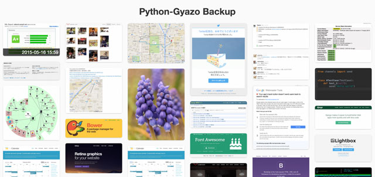

Backup
======
python-gyazo includes a utility program called ``gyazo-backup``.
You can download all images from Gyazo with this command.

Usage
-----
First, download all images with ``gyazo-backup`` command:

.. code-block:: shell

   gyazo-backup --token <API_ACCESS_TOKEN> <DESTINATION_DIR>

Then, you can see all downloaded images with your favorite web browser.
Please open ``<DESTINATION_DIR>/index.html``.

Example
-------

